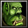

# Peon-Ping menu-bar toggle

A [SwiftBar](https://github.com/swiftbar/SwiftBar) menu-bar icon for
[peon-ping](https://github.com/) that shows whether notification sounds are on
or muted, and lets you toggle them and switch voice packs straight from the
menu bar.



- **Green dot** beside the peon — sounds are **on**.
- **Red dot** — sounds are **muted** (paused).
- Click the icon for a menu: mute/unmute, pick a sound pack (grouped by
  franchise, with per-pack preview), and refresh.

It also installs a LaunchAgent so **SwiftBar starts at login**, which means the
icon survives a restart.

## Contents

| Path | What it is |
|------|------------|
| `plugins/peonping.10s.sh` | The SwiftBar plugin. Refreshes every 10s; reads peon-ping state and renders the icon + menu. |
| `icons/peon-menubar.png` | The peon menu-bar image. |
| `launchagent/com.cloudhouse.peonping.swiftbar.plist` | LaunchAgent that opens SwiftBar at login. |
| `Toggle Peon-Ping.command` | Optional double-click toggle for sounds (also nudges SwiftBar to refresh). |
| `install.sh` | Copies everything into place and registers the LaunchAgent. |

## Requirements

- macOS
- [SwiftBar](https://github.com/swiftbar/SwiftBar) — `brew install --cask swiftbar`
- [peon-ping](https://github.com/) installed, with its hook at
  `~/.claude/hooks/peon-ping/peon.sh` and config at
  `~/.claude/hooks/peon-ping/config.json`.

## Install

```sh
./install.sh
```

This will:

1. Copy `peonping.10s.sh` and `peon-menubar.png` into
   `~/Library/Application Support/SwiftBar/`.
2. Copy the `Toggle Peon-Ping.command` into `~/Applications/`.
3. Install and load the LaunchAgent so SwiftBar launches at login.
4. Start SwiftBar and refresh.

## Uninstall

```sh
launchctl bootout "gui/$(id -u)/com.cloudhouse.peonping.swiftbar"
rm ~/Library/LaunchAgents/com.cloudhouse.peonping.swiftbar.plist
rm ~/Library/Application\ Support/SwiftBar/Plugins/peonping.10s.sh
rm ~/Library/Application\ Support/SwiftBar/peon-menubar.png
rm ~/Applications/Toggle\ Peon-Ping.command
```

## Notes

- SwiftBar spaces its plugin items with a little more padding than native menu
  extras, so the icon sits slightly further from its neighbour than a native
  icon would. That's a SwiftBar behaviour, not something in this plugin.
- The plugin and LaunchAgent reference paths under `$HOME`, so they work for
  any user without editing — as long as SwiftBar is at `/Applications/SwiftBar.app`.
